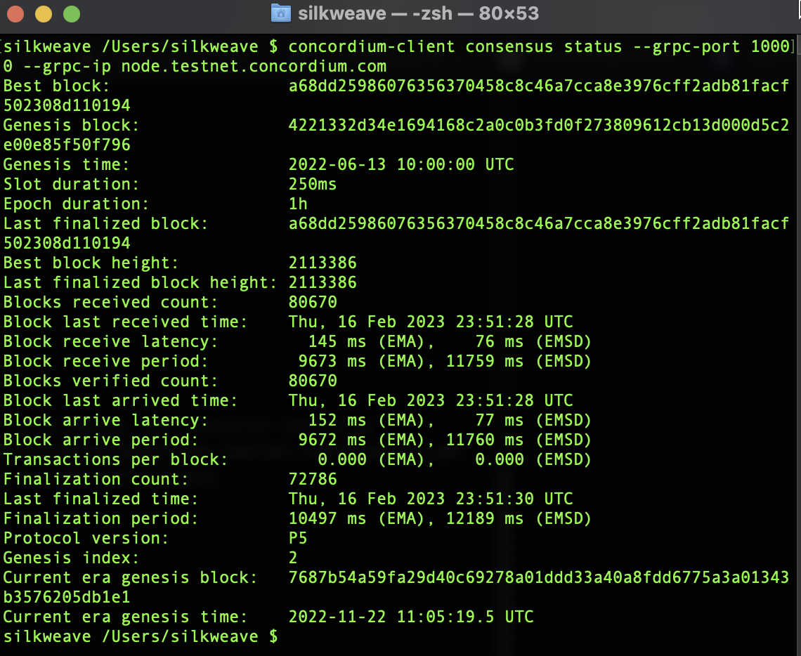

# Hackathon: Concordium Hackathon - The Future of Identity

Concordium Mainnet address: 3kKn2kz9YHrkrKUcBZF9NUJbg8LqGzcBbLwzH1VPBdEqseZH1c

The Concordium blockchain is a technologically advanced and meticulously designed blockchain that facilitates both private and public transactions, while adhering to strict regulatory standards. With its unparalleled scientific foundation, it boasts a high throughput, expedited transaction processing, and predictable fee structures, empowering businesses, developers, and traders to fully leverage the transformative power and potential of blockchain technology.

Prior to utilizing the Concordium blockchain, it is strongly recommended acquainting oneself with the fundamental principles and concepts of this distinct blockchain.

# TASK 1: Setup Development Environment

- Install Rust
- Install cargo-concordium
- Install Concordium-client
- Install the Web Wallet
- Create a Testnet account
- Acquiring testnet CCD via the CCD faucet
- Export the account from web wallet and import it into concordium client

# Install Rust and Cargo

Download and install [Rustup](https://rustup.rs/) which installs both Rust and Cargo.

If on Unix, enter the following command:

```console
curl --proto '=https' --tlsv1.2 -sSf https://sh.rustup.rs | sh
```

Make sure to select the default option at the terminal (1).


# Install Wasm

```console
rustup target add wasm32-unknown-unknown
```


# Install Concordium

Download and install [Concordium 2.7.0](https://developer.concordium.software/en/mainnet/net/installation/downloads-testnet.html#cargo-concordium-testnet). Rename it to ```cargo-concordium```.


If one Unix, move the renamed file to something clear but within your PATH, such as:

```console
- mv cargo-concordium ~/.cargo/bin
```

Note, if on MacOS, chmod it like:

```console
chmod +x path/to/cargo-concordium
```

Then, test you set it up correctly by typing:

```console
cargo concordium --help
```

You should see a screen that indicates you've got it working.

# Install Concordium Client

Assigned tutorials use concordium-client as a command line tool to deploy, mint, and transfer. So, if you're on MacOS, the installer should be straightforward and be installed with the [binary](https://developer.concordium.software/en/mainnet/net/installation/downloads-testnet.html#concordium-node-and-client-download-testnet) file. Remember to rename the package to concordium-client in case it has a different version.


Check the installation (1):

```console
concordium-client --help
```

And then connect to testnet (2):

```console
concordium-client consensus status --grpc-port 10000 --grpc-ip node.testnet.concordium.com
```



# Setup a wallet and setup testnet

Get a Concordium browser-extension wallet for Chrome/Brave/Firefox [here](https://developer.concordium.software/en/mainnet/net/browser-wallet/setup-browser-wallet.html#setup-bw).

The wallet uses a 24-word secret recovery phrase to secure your wallet. Nobody will ever ask you for it, and keep it secret!

Now configure the wallet to sit on testnet, with an ID account built from the Concordium testnet IP and identity.

Follow the instructions accordingly:


# Acquiring testnet CCD via the CCD faucet

Also, request 2000 CCD from the testnet faucet:


Acquiring testnet CCD via the CCD faucet

And then, use your wallet to export the keys:

You can now use <YOUR PUBLIC ADDRESS.export> to create a
```concordium-client``` configuration and a ```wallet```.


# Export the account from web wallet and import it into concordium client

Write down the following command accurately:

```console
concordium-client config account import <YOUR PUBLIC ADDRESS.export> --name <Your-Wallet-Name>
Enter encryption password: <TYPE_A_PASSWORD>
```


Concordium Mainnet address: 3kKn2kz9YHrkrKUcBZF9NUJbg8LqGzcBbLwzH1VPBdEqseZH1c
Concordium Testnet address: 4jRDrPgWdyfecgA6USLgk9ABfHByzNVMucht96q6VYokhSu6id

Once done, all should be written to the disk and you're done!

---

<h1> Hey there!</h1>

<p>Welcome to my GitHub!</br>

I'm 0xSilkweave, a front-end developer and Web3 enthusiast. 

---

###

<p align="left">Tools:</p>

###

<div align="left">
<a href="https://developer.mozilla.org/en-US/docs/Web/JavaScript" target="_blank" rel="noreferrer"></a>
<a href="https://reactjs.org/" target="_blank" rel="noreferrer"></a>
<a href="https://developer.mozilla.org/en-US/docs/Glossary/HTML5" target="_blank" rel="noreferrer"></a>
<a href="https://www.w3.org/TR/CSS/#css" target="_blank" rel="noreferrer"></a>
<a href="https://www.figma.com/" target="_blank" rel="noreferrer"></a>
<a href="https://tailwindcss.com/" target="_blank" rel="noreferrer"></a>
<a href="https://getbootstrap.com/" target="_blank" rel="noreferrer"></a>
<a href="https://vitejs.dev/" target="_blank" rel="noreferrer"></a>
<a href="https://nodejs.org/en/" target="_blank" rel="noreferrer"></a>
<a href="https://firebase.google.com/" target="_blank" rel="noreferrer"></a>
<a href="https://docs.alchemy.com/alchemy/documentation/alchemy-web3" target="_blank" rel="noreferrer"></a>
<a href="https://hardhat.org/" target="_blank" rel="noreferrer"></a>
<a href="https://ethereum.org/en/" target="_blank" rel="noreferrer"></a>
</div>

<p align="left">Contact:</p>

###
<div align="left">
  <a href="https://twitter.com/0xSilkweave" target="_blank">
    
  </a>
  <a href="https://discordapp.com/users/0xSilkweave#0947" target="_blank">
    
  </a>
</div>

###
